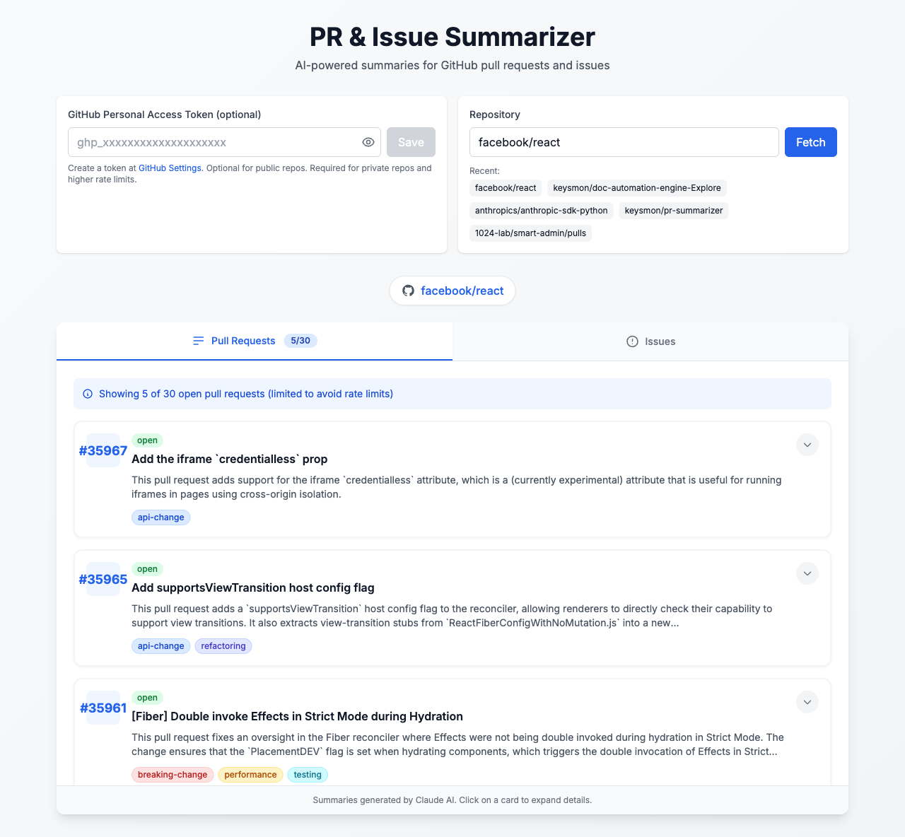

# PR & Issue Summarizer Dashboard

A web application that fetches GitHub PRs/Issues and uses Claude AI to generate summaries, risk tags, and test checklists.



## Tech Stack

- **Frontend**: Next.js 14 (TypeScript) with Tailwind CSS
- **Backend**: FastAPI (Python)
- **APIs**: GitHub REST API, Claude AI via Amazon Bedrock
- **Auth**: GitHub Personal Access Token (user-provided)
- **Deployment**: Vercel (frontend) + AWS App Runner (backend)

## Project Structure

```
pr-summarizer/
├── frontend/                    # Next.js application
│   ├── src/
│   │   ├── app/                 # App router pages
│   │   ├── components/          # React components
│   │   ├── lib/                 # API client
│   │   └── types/               # TypeScript types
│   ├── amplify.yml              # AWS Amplify build config
│   └── package.json
│
├── backend/                     # FastAPI application
│   ├── app/
│   │   ├── main.py              # FastAPI entry point
│   │   ├── config.py            # Environment config
│   │   ├── routers/             # API endpoints
│   │   ├── services/            # Business logic
│   │   └── models/              # Pydantic schemas
│   ├── requirements.txt
│   └── Dockerfile
│
├── scripts/                     # Deployment scripts
│   └── deploy-backend.sh        # ECR/App Runner deployment
│
├── docs/                        # Documentation
│   └── AWS_DEPLOYMENT.md        # Detailed AWS deployment guide
│
└── docker-compose.yml           # Local development
```

## Prerequisites

- Python 3.11+
- Node.js 18+
- AWS credentials with Bedrock access (for Claude AI)
- GitHub Personal Access Token (for users)

## Local Development

### Backend

```bash
cd backend

# Create virtual environment
python -m venv venv
source venv/bin/activate  # On Windows: venv\Scripts\activate

# Install dependencies
pip install -r requirements.txt

# Create .env file
cp .env.example .env
# Edit .env and add your ANTHROPIC_API_KEY

# Run development server
uvicorn app.main:app --reload
```

The backend will be available at `http://localhost:8000`.

### Frontend

```bash
cd frontend

# Install dependencies
npm install

# Create .env.local file
cp .env.local.example .env.local

# Run development server
npm run dev
```

The frontend will be available at `http://localhost:3000`.

### Using Docker

```bash
# Run backend with Docker Compose
docker-compose up --build
```

## API Endpoints

### Health Check
```
GET /health
```

### Pull Requests
```
POST /api/v1/repos/{owner}/{repo}/pulls
POST /api/v1/repos/{owner}/{repo}/pulls/{pr_number}
```

### Issues
```
POST /api/v1/repos/{owner}/{repo}/issues
POST /api/v1/repos/{owner}/{repo}/issues/{issue_number}
```

All endpoints accept a JSON body with `github_token` field.

## API Usage Examples

```bash
# Health check
curl http://localhost:8000/health

# Fetch PRs with summaries
curl -X POST http://localhost:8000/api/v1/repos/facebook/react/pulls \
  -H "Content-Type: application/json" \
  -d '{"github_token": "ghp_your_token_here"}'

# Single PR summary
curl -X POST http://localhost:8000/api/v1/repos/facebook/react/pulls/123 \
  -H "Content-Type: application/json" \
  -d '{"github_token": "ghp_your_token_here"}'
```

## Deployment

### Backend (AWS App Runner)

Automated via GitHub Actions on push to `main` (when `backend/` files change).

**Initial setup (one-time):**
1. Run `./scripts/deploy-backend.sh --create-app-runner` to create ECR repo and App Runner service
2. In App Runner console, set environment variables: `ALLOWED_ORIGINS`, `AWS_REGION`
3. Note the App Runner service URL and ARN

**Required GitHub repo secrets:**
| Secret | Description |
|--------|-------------|
| `AWS_ACCESS_KEY_ID` | IAM user access key |
| `AWS_SECRET_ACCESS_KEY` | IAM user secret key |
| `AWS_REGION` | AWS region (default: us-east-1) |
| `APP_RUNNER_SERVICE_ARN` | ARN from App Runner console |

After setup, every push to `main` that changes `backend/` files auto-deploys.

### Frontend (Vercel)

1. Import the repo in [Vercel](https://vercel.com/new)
2. Set root directory to `frontend`
3. Add environment variable: `NEXT_PUBLIC_API_URL` = your App Runner URL
4. Deploy — Vercel auto-deploys on every push to `main`

### Manual Backend Deployment

```bash
./scripts/deploy-backend.sh              # push to ECR only
./scripts/deploy-backend.sh --create-app-runner  # also create App Runner service
```

For detailed AWS setup instructions, see [docs/AWS_DEPLOYMENT.md](docs/AWS_DEPLOYMENT.md).

## Environment Variables

### Backend (.env)
```
AWS_REGION=us-east-1
ALLOWED_ORIGINS=http://localhost:3000,https://your-vercel-domain.vercel.app
LOG_LEVEL=INFO
```

### Frontend (.env.local)
```
NEXT_PUBLIC_API_URL=http://localhost:8000
```

## Features

- **PR Summaries**: Concise summaries of pull request changes
- **Risk Tags**: Automatic detection of breaking changes, security issues, performance impacts, etc.
- **Test Checklists**: AI-generated test suggestions for each PR
- **Issue Analysis**: Priority assessment and action items for issues
- **Copy to Clipboard**: Easy sharing of summaries
- **Recent Repos**: Quick access to previously viewed repositories

## Security Notes

- GitHub tokens are stored in browser localStorage (can be cleared via UI)
- Tokens are only sent to the backend for API calls, not stored server-side
- Backend requires CORS configuration for production domains
